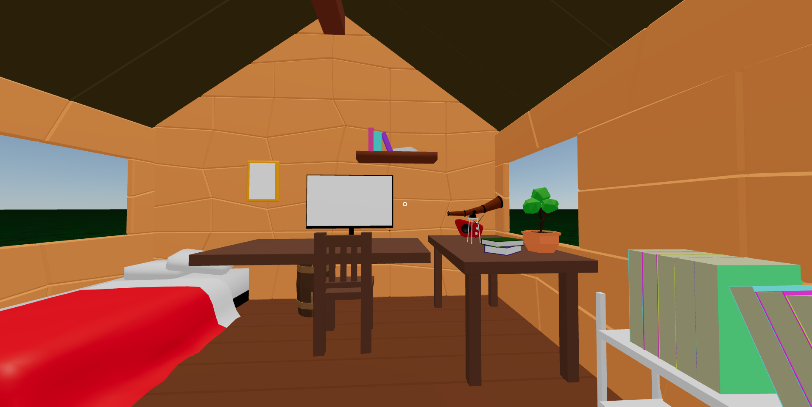
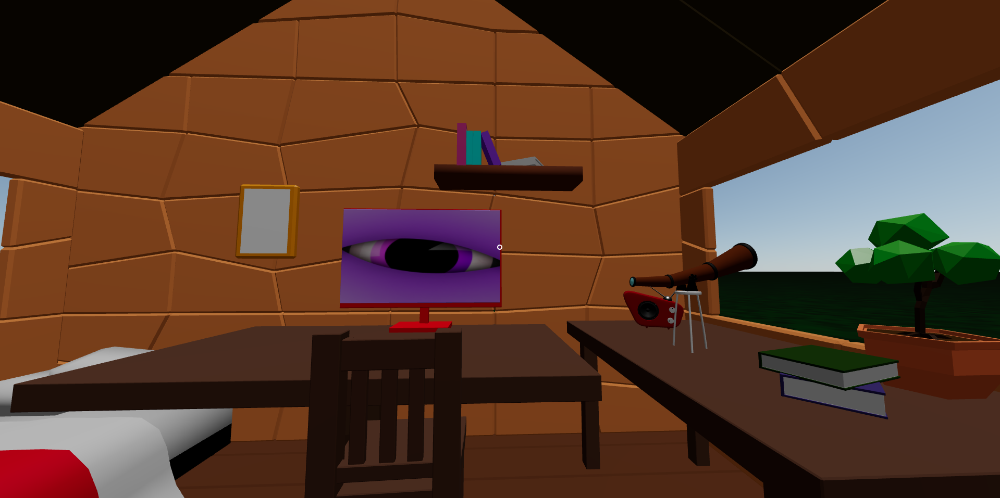

# TreeHouse Club Museum
<i>Museum where user mint TreehouseClub NFT</i>
#
</img>
### Guide Line
- Connect wallet 
- If you have got NFT that minted by treehouseclub, you can access the Treehouse Club Museum
- You should click the EnterRoom
#
</img>
- You can click Enter TreeHouseClub
- Put the NFT to photo frames, and TV
